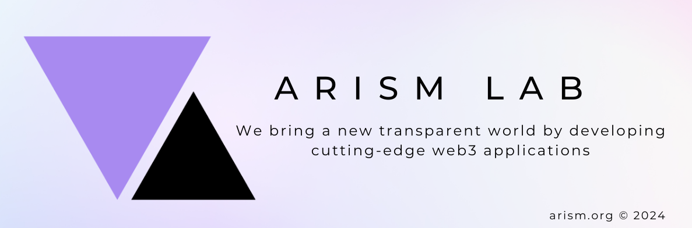

<h1>Arism Lab - Power your future</h1>
<em>We bring a new transparent world by developing cutting-edge web3 applications 🚀</em>
 
 
<a href="https://arism.org">arism.org</a> © 2024

 

## Highlight projects

### Arism Wallet

A Distributed Key and Identifier Management Protocol powered by Zero Knowledge.

- [Homepage](https://wallet.arism.org/)
- [Documentation](https://wallet.arism.org/docs)
- [Software Development Kit](https://wallet.arism.org/sdk)
- [Wallet Application](https://wallet.arism.org/app)

### Arism Game

A block building and defending Game on Telegram.

## About us

We are three young and enthusiastic Blockchain Developers who are now pround to be the Arism founders.

|     Founder      | Role                                                              | Email                                                 |
| :--------------: | ----------------------------------------------------------------- | ----------------------------------------------------- |
|   **Nhi Tran**   | Bussiness Developer / Game Developer / Blockchain Engineer        | [nhitran@arism.org](mailto:nnhitran@arism.org)        |
|  **Kiet Tran**   | DevOps Engineer / Backend Developer / Smart Contract Engineer     | [kiettran@arism.org](mailto:kiettran@arism.org)       |
| **Thuan Nguyen** | Security Engineer / Fullstack Developer / Smart Contract Engineer | [thuannguyen@arism.org](mailto:thuannguyen@arism.org) |

## Contact us

Need help? Got a question? Want to work with us? Feel free to contact us at [support@arism.org](mailto:support.arism.org).
